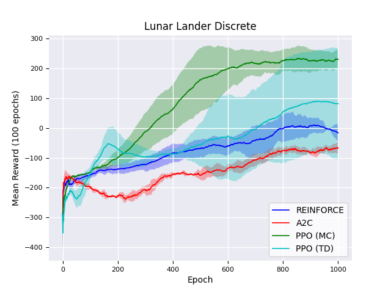
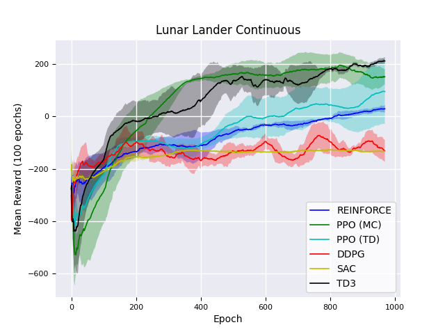

# Policy-gradient DeepRL

This repository contains several policy-gradient Deep Reinforcement Learning (DRL) methods. 
The proposed algorithms are separated into different folders to provide an easy-to-understand documented code (an algorithm relies only on dependencies in its folder), written in Tensorflow 2.

This repository is constantly being updated and represents a baseline for policy-gradient DRL research.
It contains implementation of the following policy-gradient algorithms for continuous action spaces:

* REINFORCE with baseline [1]
* Deep Deterministic Policy Gradient (DDPG) [2]
* Proximal Policy Optimization with Monte Carlo approximation (PPO_MC) [3]
* Proximal Policy Optimization with Temporal Difference approximation (PPO_TD) [3]
* Soft Actor-Critic (SAC) [4]
* Twin Delayed DDPG (TD3) [5]

It contains implementation of the following policy-gradient algorithms for discrete action spaces:
* REINFORCE with baseline [1]
* Vanilla Actor-Critic (AC) [1]
* Advantage Actor-Critic with importance sampling for off-policy udpates (A2C) [6]
* Proximal Policy Optimization with Monte Carlo approximation (PPO_MC) [3]
* Proximal Policy Optimization with Temporal Difference approximation (PPO_TD) [3]

### Results

The proposed approaches are evaluated over different seeds in the LunarLander discrete and continuous environment. 
Follows our results of the performance (i.e., mean reward over 100 epochs) of the algorithms. Notice that we considered "common" hyperparameters for our evaluation, without any fine tuning (SAC poor performance are due tothe lack of specific tuning).

  
  

### Requirements

* Python 3.x
* Installing the following packages:
	* Tensorflow 2, h5py, Yaml, Numpy, Gym
 
### Train the value-based algorithms

- Clone this repo to your local machine using `git clone ...`.
- Edit the `config.yml` file with your hyperparameters or desired environment
- Train the DRL approach using the `main.py` script.

## References

[1] [Reinforcement Learning: An Introduction](http://www.incompleteideas.net/book/the-book-2nd.html)

[2] [Continuous control with deep reinforcement learning](https://arxiv.org/abs/1509.02971)

[3] [Proximal Policy Optimization Algorithms](https://arxiv.org/abs/1707.06347)

[4] [Soft Actor-Critic: Off-Policy Maximum Entropy Deep Reinforcement Learning with a Stochastic Actor](https://arxiv.org/abs/1801.01290)

[5] [Addressing Function Approximation Error in Actor-Critic Methods](https://arxiv.org/abs/1802.09477)

[6] [Asynchronous Methods for Deep Reinforcement Learning](https://arxiv.org/abs/1602.01783v2)

## License

- **MIT license**
